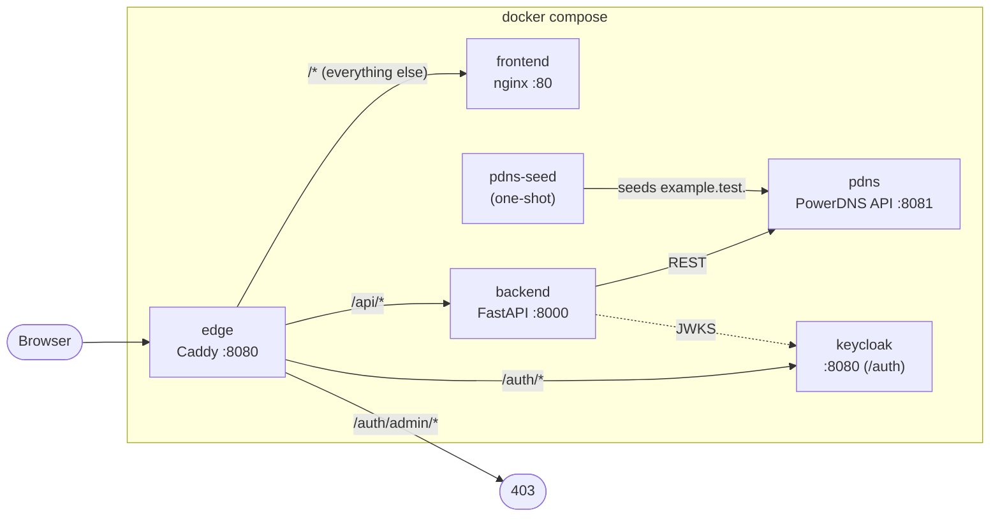
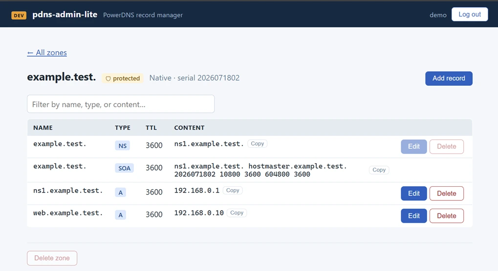

# pdns-admin-lite

[](https://github.com/Supaahiro/pdns-admin-lite/actions/workflows/release.yml)

A minimal web UI for managing DNS records on a **PowerDNS Authoritative** server, built as a proof of concept: a **FastAPI** backend acting as a thin adapter over the PowerDNS REST API, and a **Vue 3 + Vite** frontend served by nginx, all wired together behind a **Caddy** edge proxy with docker-compose.

> Scope note: this UI owns the lifecycle of the *demo/dev* zone — or whatever zone you point it
> at and intend it to own — subject to `PROTECTED_ZONES`. Zones provisioned elsewhere (Ansible,
> a real homelab's authoritative config) stay untouchable through this tool by naming them there.



---

## Key Features

- 📋 Zone list and per-zone record table (SOA and other unmanaged types shown read-only), with a client-side filter over name/type/content and one-click copy on record values
- ✏️ Create, edit, and delete record sets (`A`, `AAAA`, `CNAME`, `TXT`, `MX`, `SRV`, `NS`, `PTR`) via PowerDNS `rrsets` PATCH calls, destructive actions behind a confirmation dialog
- 🌐 Create and delete zones (`Native` kind), with `PROTECTED_ZONES` making the zone(s) you designate — and their subzones — permanently un-deletable and un-shadowable, enforced server-side regardless of who is authenticated
- 🔌 Backend is a thin async adapter (`httpx`) over the PowerDNS REST API — no database of its own
- 🔐 Record mutations require a Keycloak-issued token (`Authorization: Bearer`), verified server-side against the realm's JWKS — the API itself keeps `GET` anonymous, matching what an open AXFR would already leak; the SPA additionally gates every screen behind sign-in via a router guard
- 🐳 Self-contained dev stack: Caddy edge (only published port) → nginx static frontend + FastAPI backend + a disposable, seeded demo PowerDNS + a dev-mode Keycloak identity provider
- 🧪 Backend test suite mocks PowerDNS with `respx` — no live DNS server needed in CI

## Architecture

The backend fetches JWKS from Keycloak over the compose network (`http://keycloak:8080/auth/...`)
but asserts the browser-visible issuer (`${PUBLIC_ORIGIN}/auth/realms/pdns-admin-lite`) in
token claims — the two URLs differ because "the backend" and "the browser" reach Keycloak
from different places, but tokens only ever carry the browser-visible one.

| Path | What it is |
|---|---|
| `backend/` | FastAPI app (Poetry, Python 3.13): `core/pdns.py` PowerDNS client, `api/routes.py` endpoints, `tests/` — see [backend/CONVENTIONS.md](backend/CONVENTIONS.md) |
| `frontend/` | Vue 3 + Vite + TypeScript SPA, multi-stage Dockerfile ending in `nginx:alpine` — see [frontend/CONVENTIONS.md](frontend/CONVENTIONS.md) |
| `vendors/pdns/seed.sh` | One-shot seeder creating the demo `example.test.` zone through the same API calls Ansible uses |
| `vendors/keycloak/realm-export.json` | Checked-in realm (`pdns-admin-lite` realm, `pdns-admin-lite-spa` public PKCE client, `demo` user), imported at startup via `--import-realm` |
| `docker-compose.yml` | Dev stack: `edge`, `frontend`, `backend`, `pdns`, `pdns-seed`, `keycloak` |
| `Caddyfile` | Edge routing: `/api/*` → backend, `/auth/admin/*` → 403, `/auth/*` → keycloak, everything else → frontend |

### Identity (Keycloak, dev mode)

The compose stack runs Keycloak in `start-dev` mode (H2, no TLS — a POC convenience, not a
production posture) behind Caddy at `/auth/*`, with the demo login `demo` / `demo`
(`DEMO_PASSWORD` in `.env`). The Keycloak **admin console and admin REST API are not reachable
through the edge** — `/auth/admin/*` returns 403 there by design. Admin operations against the
dev Keycloak go through its own CLI instead:

```bash
docker compose exec keycloak /opt/keycloak/bin/kcadm.sh config credentials \
  --server http://localhost:8080/auth --realm master --user admin --password "$KC_ADMIN_PASSWORD"
docker compose exec keycloak /opt/keycloak/bin/kcadm.sh get users -r pdns-admin-lite
```

Browsing from another machine on the LAN — the actual point of this tool — means setting one
variable in `.env` before `docker compose up`:

```bash
PUBLIC_ORIGIN=http://<host-ip>:8080
```

This feeds Keycloak's hostname, the realm's redirect URIs, and the issuer the backend asserts,
so login and token validation keep working from any machine that can reach that origin.
Changing `PUBLIC_ORIGIN` (or `DEMO_PASSWORD`) after the first `up` requires recreating the
container so the realm re-imports with the new placeholder values:

```bash
docker compose up --force-recreate keycloak
```

**Signing in:** the SPA uses `oidc-client-ts` for Authorization Code + PKCE against the realm
above. Tokens are kept in memory only — never `localStorage` — so an XSS bug can't yield a
durable credential; the trade-off is that a hard refresh drops the in-memory token, recovered
transparently via a silent re-authentication against Keycloak's SSO session cookie (a hidden
iframe hitting `/silent-renew.html`). A router guard gates every SPA route behind sign-in: an
anonymous visitor hitting `/` or a deep link like `/zones/example.test.` is redirected to
`/login`, and lands back on the originally requested path once they authenticate. This is a
frontend UX/access-control layer, not a mirror of the backend policy — the API's `GET` endpoints
stay anonymous by design (see below), so a bare `curl http://localhost:8080/api/zones` still
works without a token even though the SPA itself won't render without one. Mutating endpoints
are enforced independently server-side regardless of what the UI shows — a bare `curl -X PUT`
without a token gets `401`.

> **Before trusting this on your LAN:** with the checked-in `demo`/`demo` credentials and
> default `KC_ADMIN_PASSWORD`, any LAN user who can reach `:8080` can log in and mutate DNS
> records. Rotate `DEMO_PASSWORD` and `KC_ADMIN_PASSWORD` in `.env` before relying on this
> beyond a local demo, and set `PROTECTED_ZONES` to the zone(s) that actually matter. What the
> defaults still guarantee regardless of credentials: there is no admin-console side door
> (blocked at the edge, not just hidden), and the zones named in `PROTECTED_ZONES` — plus any of
> their subzones — cannot be deleted or shadowed by any authenticated user, including one who
> has correctly guessed the demo password.

## Prerequisites

- Docker + docker compose (for the full stack)
- Optional, for local development outside containers: Python ≥ 3.13 with [Poetry](https://python-poetry.org/), Node.js ≥ 24

## Quick Setup

```bash
cp .env.example .env
docker compose up --build
```

Then open <http://localhost:8080> — the demo `example.test.` zone is already seeded, and you can log in with `demo` / `demo`.

### What to try

A walkthrough that exercises every guarantee this project makes, in order:

1. **Browse anonymously.** The zone list and record tables render with no login — `GET` is
   intentionally open, matching what an open AXFR would already leak.
   ```bash
   curl http://localhost:8080/api/zones
   curl http://localhost:8080/api/zones/example.test.
   ```
2. **Try a mutation without a token — 401.** The API refuses regardless of what the UI shows.
   ```bash
   curl -i -X PUT http://localhost:8080/api/zones/example.test./records \
     -H "Content-Type: application/json" \
     -d '{"name":"web","type":"A","ttl":3600,"records":["203.0.113.10"]}'
   ```
3. **Log in** with `demo` / `demo` (top-right, or the full-page prompt on a protected route) and
   add or edit a record — the SPA now attaches the token and the mutation succeeds.
4. **Create a zone**, then **try to delete `example.test.`** — refused with `403 zone_protected`,
   both in the UI (the button stays disabled) and directly:
   ```bash
   curl -i -X DELETE http://localhost:8080/api/zones/example.test. \
     -H "Authorization: Bearer <token-from-the-browser-devtools>"
   ```
5. **Confirm the admin console has no side door:**
   ```bash
   curl -i http://localhost:8080/auth/admin/
   ```
   → `403`, blocked at the edge before it ever reaches Keycloak.

## Configuration

All settings come from environment variables (see `.env.example`):

| Variable | Default | Purpose |
|---|---|---|
| `EDGE_PORT` | `8080` | Host port published by the Caddy edge |
| `PUBLIC_ORIGIN` | `http://localhost:8080` | Origin browsers use; feeds Keycloak's hostname, redirect URIs, and the issuer the backend asserts |
| `PDNS_API_URL` | `http://pdns:8081/api/v1` | PowerDNS API endpoint the backend talks to |
| `PDNS_API_KEY` | `changeme-dev-key` | PowerDNS API key (`X-API-Key` header) |
| `PROTECTED_ZONES` | `example.test.` | Comma-separated; these zones and their subzones can never be deleted or created-over, regardless of who is authenticated |
| `DEFAULT_NS` | `ns1.example.test.` | NS content for zones created through the UI |
| `KC_ADMIN_USER` / `KC_ADMIN_PASSWORD` | `admin` / `changeme-dev-admin` | Keycloak bootstrap admin (console not routed through the edge; use `kcadm.sh`, see above) |
| `DEMO_PASSWORD` | `demo` | Password for the `demo` login |
| `OIDC_ISSUER` / `OIDC_JWKS_URL` / `OIDC_AUDIENCE` | derived from `PUBLIC_ORIGIN` | Token validation settings the backend enforces on record mutations |

### Pointing at a real PowerDNS

Set the real endpoint and key in `.env` (never commit it — it is gitignored):

```bash
PDNS_API_URL=http://10.0.0.12:8081/api/v1
PDNS_API_KEY=<real-key>
```

Then start only the app services, skipping the demo DNS server (Keycloak stays — auth is part of the app):

```bash
docker compose up --build --no-deps edge frontend backend keycloak
```

Before pointing this at a zone you actually care about, work through the **"Before trusting this
on your LAN"** checklist above: rotate `DEMO_PASSWORD` and `KC_ADMIN_PASSWORD`, and set
`PROTECTED_ZONES` to the real zone(s) this server is authoritative for — the demo default
(`example.test.`) protects nothing on your actual DNS.

> Note: the edge listens on plain HTTP for this POC. Switching Caddy to TLS is a two-line `Caddyfile` change (`tls internal` or a real hostname with ACME).

## Local development

Backend (REPL-friendly, auto-reload):

```bash
cd backend
poetry install
poetry run pytest -v                 # unit tests, PowerDNS mocked with respx
poetry run uvicorn main:app --reload # http://localhost:8000, needs a reachable PDNS_API_URL
```

Frontend (Vite dev server proxies `/api` to `http://localhost:8000`, so no CORS setup is needed):

```bash
cd frontend
npm install
npm run dev     # http://localhost:5173
npm run build   # type-check (vue-tsc) + production bundle
```

Tip: `docker compose up pdns pdns-seed` gives you a disposable seeded PowerDNS on the compose network; add `ports: ["8081:8081"]` to the `pdns` service locally if you want to reach it from the host.

See [backend/CONVENTIONS.md](backend/CONVENTIONS.md) and [frontend/CONVENTIONS.md](frontend/CONVENTIONS.md) before contributing — they cover the error/auth/zone-protection patterns and the UI/UX rules this codebase expects new code to follow.

## API surface

| Endpoint | Auth | Maps to (PowerDNS) | Notes |
|---|---|---|---|
| `GET /api/health` | anonymous | — | liveness, used by the Docker healthcheck |
| `GET /api/zones` | anonymous | `GET /zones` | id, name, kind, serial, `protected` |
| `GET /api/zones/{zone_id}` | anonymous | `GET /zones/{id}` | includes rrsets, sorted by name/type |
| `POST /api/zones` | **Bearer token** | `POST /zones` | body `{"name": "lab.test"}`; `kind: Native`; 409 `zone_exists` if it already exists; 403 `zone_protected` if the name is a subzone of a protected zone; 422 `invalid_zone_name` for non-LDH names |
| `DELETE /api/zones/{zone_id}` | **Bearer token** | `DELETE /zones/{id}` | 403 `zone_protected` for a protected zone or any of its subzones |
| `POST /api/zones/{zone_id}/records` | **Bearer token** | `PATCH` (`REPLACE`) | 409 if the rrset already exists; 403 `zone_protected` for the apex `NS` rrset of a protected zone |
| `PUT /api/zones/{zone_id}/records` | **Bearer token** | `PATCH` (`REPLACE`) | replaces the whole rrset; same apex-`NS` guard as above |
| `DELETE /api/zones/{zone_id}/records?name=&type=` | **Bearer token** | `PATCH` (`DELETE`) | deletes the rrset; same apex-`NS` guard as above |

Mutating endpoints require `Authorization: Bearer <token>` with a token issued by this stack's Keycloak realm (`aud: pdns-admin-lite-api`, RS256, verified against the realm's JWKS). Missing/invalid token → `401 not_authenticated`; OIDC settings unset on the backend → `503 auth_not_configured` (fails closed, never open).

Record names may be relative (`web`), `@` or `` (empty) for the zone apex, or FQDNs — the backend canonicalizes them to the trailing-dot form PowerDNS expects, in every form, before any protection check runs. The exact zone-protection matrix (what's allowed on a protected zone vs. its subzones vs. any other zone) lives in [backend/CONVENTIONS.md](backend/CONVENTIONS.md).



## License

This project is licensed under a **No-Commercial License** — see the repository root [LICENSE](LICENSE) file.

## Links

- Main repo — [github.com/Supaahiro/schwifty-lab](https://github.com/Supaahiro/schwifty-lab)
- Blog — [www.schwifty-lab.org](https://www.schwifty-lab.org/)
